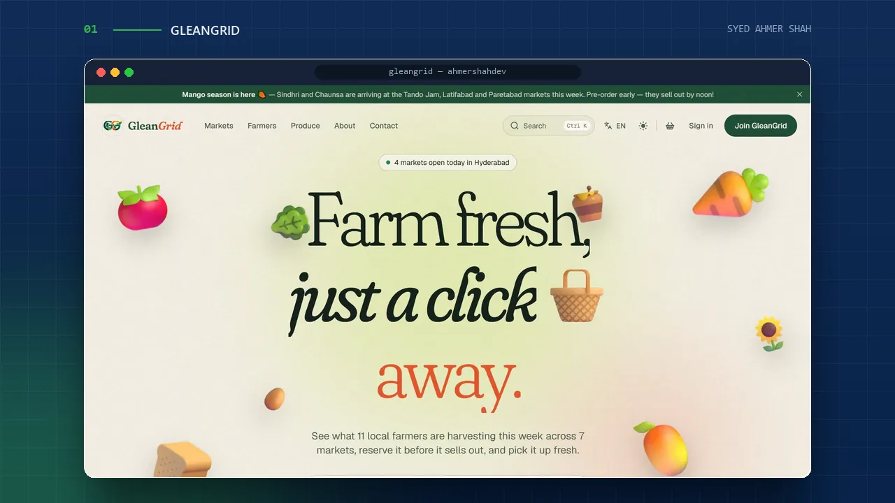
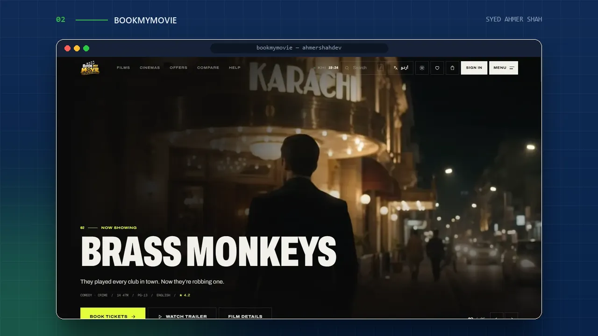
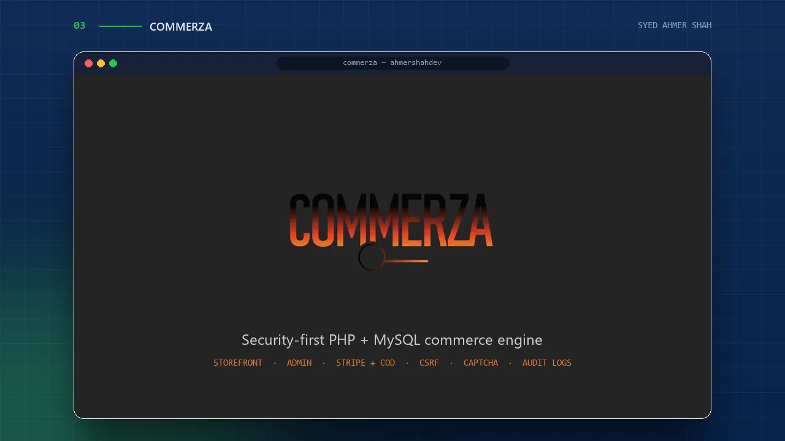

<!--
  Syed Ahmer Shah (@ahmershahdev) — Full-Stack Developer, Laravel & WordPress Developer,
  Software Engineering undergraduate from Hyderabad, Pakistan. Portfolio: https://ahmershah.dev/
-->

<a href="https://ahmershah.dev/">
  
</a>

<h1 align="center">Syed Ahmer Shah — Full-Stack Developer &amp; Software Engineer</h1>

<p align="center">
  
</p>

<p align="center">
  I build <strong>production-grade web applications</strong> — secure Laravel &amp; PHP back-ends, fast React front-ends and
  conversion-focused <strong>e-commerce &amp; WordPress</strong> sites — from Hyderabad, Pakistan, and document the process in public.
</p>

<p align="center">
  <a href="https://ahmershah.dev/"></a>
  <a href="https://linkedin.com/in/syedahmershah"></a>
  <a href="https://github.com/ahmershahdev"></a>
  <a href="https://www.fiverr.com/ahmershahdev"></a>
  <a href="https://www.upwork.com/freelancers/~01d033487ce8ecd83f"></a>
</p>

<p align="center">
  
  
  
  
</p>

<br>

<p align="center"><sub><a href="#01--about">About</a> &nbsp;·&nbsp; <a href="#02--selected-work">Selected Work</a> &nbsp;·&nbsp; <a href="#03--stack">Stack</a> &nbsp;·&nbsp; <a href="#04--education">Education</a> &nbsp;·&nbsp; <a href="#05--certifications">Certifications</a> &nbsp;·&nbsp; <a href="#06--find-syed-ahmer-shah-online">Find Me Online</a></sub></p>

---

## 01 — About

Software Engineering undergraduate, **full-stack developer** and **WordPress developer** on freelancing platforms. I care about the parts users never see — row-locked checkouts, CSRF and rate limits, clean database design — so the parts they do see stay fast and trustworthy.

```js
const ahmer = {
  name: "Syed Ahmer Shah",
  pronouns: "He/Him",
  role: "Software Engineering Undergraduate · Full-Stack Developer",
  location: "Hyderabad, Pakistan",
  code: ["PHP", "JavaScript", "TypeScript", "Java", "HTML5", "CSS3"],
  askMeAbout: ["Web Dev", "E-commerce", "OOP", "Web Security", "SEO"],
  technologies: {
    frontEnd: {
      js: ["React", "Inertia.js", "jQuery", "Vanilla JS"],
      css: ["Tailwind CSS", "Bootstrap", "CSS"],
    },
    backEnd: {
      php: ["Laravel"],
      java: ["Core Java"],
    },
    databases: ["MySQL"],
    platforms: ["WordPress", "Firebase", "Supabase", "Vercel"],
    tools: ["Git", "Playwright"],
  },
  currentFocus: "Laravel + React products · expanding into MERN & cross-platform apps",
  funFact: "I can turn coffee into code! ☕→💻",
};
```

---

## 02 — Selected Work

<!-- ─────────────── 01 · GleanGrid ─────────────── -->

<a href="https://github.com/ahmershahdev/GleanGrid">
  
</a>

### GleanGrid — Farmers-Market Pre-Order Platform

**Farm fresh, just a click away.** Customers reserve this week's harvest from Hyderabad's farmers markets, pay with Easypaisa, JazzCash, card or cash, and collect it at the stall. Built for Aptech TechWiz 7.

- **Race-condition-proof checkout** — MySQL row locking so the last mango is sold exactly once
- **Three roles** — customers, farmers and admins, each with their own dashboard
- **8 languages** including right-to-left Urdu and Arabic, light &amp; dark themes, installable PWA
- **Hardened &amp; tested** — nonce-based CSP, Inertia SSR for SEO, 133 passing tests with Playwright CI

<p>
  
  
  
  
  
  
  
</p>

<a href="https://github.com/ahmershahdev/GleanGrid"></a>

<br>

<!-- ─────────────── 02 · BookMyMovie ─────────────── -->

<a href="https://github.com/ahmershahdev/bookmymovie">
  
</a>

### BookMyMovie — Cinema Ticket Booking for Pakistan

A full-stack cinema platform with no page reloads: browse films, watch trailers, pick seats on a live map — or from inside a **3D model of the hall** — add snacks and book. Built for the Aptech DISM project.

- **Live &amp; 3D seat maps** with row-tier pricing, "best seats together" and a 10-minute hold
- **Signed QR e-tickets** that work offline and go straight into Apple or Google Wallet
- **Food add-ons, loyalty points &amp; gift cards**, verified-booking reviews and an Urdu interface
- **Back office** — live occupancy per screen, refunds, ticket scanning and a full audit log

<p>
  
  
  
  
  
  
  
</p>

<a href="https://github.com/ahmershahdev/bookmymovie"></a>

<br>

<!-- ─────────────── 03 · Commerza ─────────────── -->

<a href="https://github.com/ahmershahdev/commerza">
  
</a>

### Commerza — Full-Stack E-commerce Platform

The **security-first PHP + MySQL engine** for modern digital commerce. Built for speed, designed for developers, hardened for production — a modern storefront and a secure admin dashboard, written without a framework.

- **Complete storefront** — catalogue, search, cart, wishlist, compare, reviews and order tracking
- **Checkout** — Cash on Delivery + Stripe with server-side verification, coupons and stock locking
- **Enterprise security** — CSRF, CAPTCHA, rate limiting, idempotency and audit logs
- **Admin operations** — KPIs, product &amp; order management, refunds and role-based sub-admins

<p>
  
  
  
  
  
  
  
</p>

<a href="https://github.com/ahmershahdev/commerza"></a>

---

## 03 — Stack

<p align="center">
  <a href="https://skillicons.dev">
    <picture>
      <source media="(prefers-color-scheme: light)" srcset="https://skillicons.dev/icons?i=php,laravel,js,ts,react,html,css,tailwind,bootstrap,jquery,java,mysql,wordpress,firebase,supabase,vercel,git&perline=9&theme=light" />
      
    </picture>
  </a>
</p>

| Area | Tools |
|:---|:---|
| **Languages** | PHP · JavaScript · TypeScript · Java · HTML5 · CSS3 |
| **Front-end** | React · Inertia.js · Tailwind CSS · Bootstrap · jQuery · Three.js |
| **Back-end** | Laravel · Core Java |
| **Data** | MySQL · Firebase · Supabase |
| **Platforms** | WordPress · Shopify · Vercel · Git / GitHub |
| **Craft** | SEO · Web security · Accessibility · PWA · Playwright testing |

---

## 04 — Education

| Period | Institution | Program |
|:---|:---|:---|
| Nov 2024 – Dec 2028 | Hyderabad Institute For Technology & Management Science | Bachelor's in Software Engineering |
| Aug 2025 – Sep 2028 | Aptech Pakistan | Advanced Diploma in Software Engineering (ADSE) |
| Jul 2022 – Jul 2024 | Superior College of Science, Hyderabad | HSC, Pre-Engineering |
| Apr 2012 – Jul 2022 | St. Bonaventure's High School, Hyderabad (City Branch) | SSC, Computer Science |

---

## 05 — Certifications

<details>
<summary><strong>20+ verified certifications — click to expand</strong></summary>
<br>

| Certification | Issuer | Date | Credential ID |
|:---|:---|:---|:---|
| IBM iOS and Android Mobile App Developer | Coursera | Mar 2026 | O5XTNLP93YFL |
| Meta React Native | Coursera | Mar 2026 | DYOMSGSDW68E |
| JavaScript Programming with React, Node & MongoDB | Coursera | Mar 2026 | 0ZVBSCIPTMIE |
| IBM Full Stack Software Developer | IBM via Coursera | Mar 2026 | GKN6NX33K09T |
| IBM JavaScript Backend Developer | IBM via Coursera | Mar 2026 | FHUZZ7YUTQP9 |
| Microsoft Full-Stack Developer | Microsoft via Coursera | Mar 2026 | V6FN6XK6SEKF |
| SQL Associate | DataCamp | Apr 2026 (valid thru Apr 2028) | SQA0010634184425 |
| Software Engineer Intern | HackerRank | Mar 2026 | b44b013b3e29 |
| JavaScript (Intermediate) | HackerRank | Mar 2026 | 47da08f71692 |
| CSS (Basic) | HackerRank | Mar 2026 | 4236a29e0662 |

Full list with verifiable credential links: [LinkedIn](https://linkedin.com/in/syedahmershah) · [Credly](https://www.credly.com/users/syedahmershah/)

</details>

---

## 06 — Find Syed Ahmer Shah Online

Every profile below is verified and actively maintained, grouped by purpose so you land on the right one on the first click.

### Website & Business

| | |
|:---|:---|
| [](https://ahmershah.dev/) | Portfolio, services & contact |
| [](https://g.page/r/CS9yn4Q_UhZ4EBM) | Verified local business listing |
| [](https://linktr.ee/syedahmershah) | Single link to everything |
| [](https://beacons.ai/syedahmershah) | Alternate link hub |
| [](https://gravatar.com/syedahmershah) | Universal profile & avatar |

### Freelancing — Hire Me

<sub>Full-Stack Web & App Development · E-commerce Websites · CMS (Shopify & WordPress) · Writing</sub>

| | |
|:---|:---|
| [](https://www.fiverr.com/ahmershahdev) | Hire on Fiverr — web, app & e-commerce gigs |
| [](https://www.upwork.com/freelancers/~01d033487ce8ecd83f) | Hire on Upwork — hourly & fixed-price projects |
| [](https://www.peopleperhour.com/freelancer/technology-programming/syed_ahmer-shah-syed-ahmer-shah-full-stack-web-zxqqamxq) | Hire on PeoplePerHour |
| [](https://www.freelancer.com/u/syedahmershah) | Freelancer.com profile |
| [](https://contra.com/syedahmershah?referralExperimentNid=DEFAULT_REFERRAL_PROGRAM&referrerUsername=syedahmershah) | Commission-free freelance profile |
| [](https://workchest.com/freelancer/syedahmershah) | Workchest freelancer profile |
| [](https://www.guru.com/freelancers/syed-ahmer-shah) | Guru freelancer profile |

### Professional Networking

| | |
|:---|:---|
| [](https://linkedin.com/in/syedahmershah) | Career profile & network |
| [](https://linkedin.com/company/syedahmershah) | Brand / business page |
| [](https://github.com/ahmershahdev) | Code, repos & open source |
| [](https://wellfound.com/u/syedahmershah) | Startup jobs & talent network |
| [](https://www.crunchbase.com/person/syed-ahmer-shah) | Professional business profile |
| [](https://arc.dev/@syedahmershah?preview=1) | Vetted remote developer network |
| [](https://bsky.app/profile/syedahmershah.bsky.social) | Professional microblogging |

### Brand & Content — @ahmershahdev

| | |
|:---|:---|
| [](https://instagram.com/ahmershahdev) | Dev content & behind the scenes |
| [](https://tiktok.com/@ahmershahdev) | Short-form dev content |
| [](https://youtube.com/@ahmershahdev) | Long-form dev content |
| [](https://www.facebook.com/ahmershahdev) | Developer page |
| [](https://x.com/ahmershahdev) | Dev updates & threads |

<br>

<details>
<summary><strong>✍️ Writing & Blogging</strong></summary>
<br>

| | |
|:---|:---|
| [](https://medium.com/@syedahmershah) | AWS & Software Engineering Articles |
| [](http://builder.aws.com/community/syedahmershah) | AWS Projects & Engineering Practices |
| [](https://coderlegion.com/user/syedahmershah) | Programming & Software Engineering Guides |
| [](https://dev.to/syedahmershah) | Developer Tutorials & Technical Guides |
| [](https://hashnode.com/@syedahmershah) | Architecture & Software Development Insights |
| [](https://substack.com/@syedahmershah) | Engineering Essays & Technology Perspectives |
| [](https://hackernoon.com/u/syedahmershah) | Programming, AWS & Emerging Technology |
| [](https://sessionize.com/syedahmershah) | AWS & Software Engineering Talks |

</details>

<details>
<summary><strong>💻 Coding & Problem Solving</strong></summary>
<br>

| | |
|:---|:---|
| [](https://leetcode.com/syedahmershah) | DSA problem-solving journey |
| [](https://hackerrank.com/profile/syedahmershah) | Coding challenges & scores |
| [](https://www.credly.com/users/syedahmershah/) | Verified certifications |

</details>

<details>
<summary><strong>🎨 Design & Portfolio</strong></summary>
<br>

| | |
|:---|:---|
| [](https://www.behance.net/syedahmershah) | Visual & design portfolio |
| [](https://dribbble.com/syedahmershah) | UI shots & design work |
| [](https://pinterest.com/ahmershahdev) | Professional |

</details>

<details>
<summary><strong>🏢 B2B, Business & Review Profiles</strong></summary>
<br>

| | |
|:---|:---|
| [](https://techbehemoths.com/company/syed-ahmer-shah) | B2B company profile & ratings |
| [](https://clutch.co/profile/syed-ahmer-shah) | Business & agency profile |
| [](https://www.designrush.com/agency/profile/syed-ahmer-shah) | Agency profile & directory |
| [](https://edverise.com/profile/syed-ahmer-shah) | Professional profile |
| [](https://www.trustpilot.com/review/ahmershah.dev) | Client reviews & reputation |
| [](https://feedbax.ai/profile/syed-ahmer-shah) | B2B agency profile & reviews |
| [](https://www.g2.com/products/syed-ahmer-shah/reviews#product_2016818_media) | Product reviews & profile |

</details>

<details>
<summary><strong>👤 Personal profiles (not dev-related)</strong></summary>
<br>

| | |
|:---|:---|
| [](https://www.instagram.com/ahmershah29/?hl=en) | Personal |
| [](https://www.facebook.com/ahmershah29) | Personal |
| [](https://x.com/ahmershah29) | Personal |
| [](https://tiktok.com/ahmershah29) | Personal |
| [](https://pinterest.com/ahmershah29) | Personal |

</details>

---

<p align="center">
  <a href="https://ahmershah.dev/"></a>
</p>

<p align="center"><em>"Designing order within the digital wilderness."</em><br><sub>— Syed Ahmer Shah</sub></p>

<p align="center">
  <a href="https://ahmershah.dev/"></a>
</p>

<p align="center"><sub>© 2026 Syed Ahmer Shah — All rights reserved.</sub></p>
